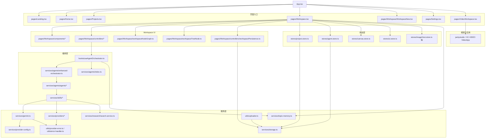
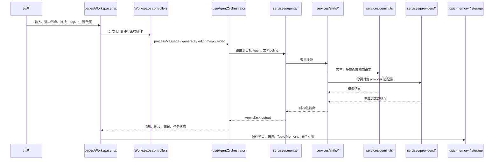

# XC-STUDIO 项目模块地图

这份文档描述当前仓库里主要模块的职责边界、依赖关系和推荐阅读顺序，供后续开发、排障和重构时快速建立上下文。

## 1. 总体拓扑

## 2. Workspace 主链路

## 3. 主要模块职责

### 页面入口

- `App.tsx`
  负责路由注册与页面懒加载，串起 `Landing / Home / Projects / Workspace / VideoWorkspace / Settings / User`。
- `pages/Workspace.tsx`
  当前主工作区入口，承接画布、聊天、树状节点、经典节点、工作流、历史、持久化和快捷操作。
- `pages/Workspace/WorkspaceNew.tsx`
  新架构实验入口，使用更明确的 Store + 组件拆分方式组织工作区。
- `pages/VideoWorkspace.tsx`
  视频工作区入口，挂载 `jackystudio` 提供的 `VideoApp`。

### Workspace 内部

- `pages/Workspace/components/*`
  工作区 UI 组件，包括画布节点、工具栏、侧栏、输入区、工作流卡片等。
- `pages/Workspace/controllers/*`
  工作区行为控制层，负责发送消息、生图、改图、蒙版编辑、节点操作、多选、项目加载、自动布局等。
- `pages/Workspace/workspaceNodeGraph.ts`
  树状关系、父子节点布局、分支排布等图结构辅助逻辑。
- `pages/Workspace/workspaceTreeNode.ts`
  树状节点相关类型与结构辅助。
- `pages/Workspace/controllers/workspacePersistence.ts`
  负责项目持久化前的压缩、序列化和恢复辅助逻辑。

### Zustand 状态层

- `stores/project.store.ts`
  管理项目级信息、设计上下文、部分研究与会话元数据。
- `stores/agent.store.ts`
  管理消息、输入块、附件、生成参数、当前任务等 Agent 相关状态。
- `stores/canvas.store.ts`
  管理画布元素、标记、缩放平移、历史记录和基础画布动作。
- `stores/ui.store.ts`
  管理工具、弹窗、面板显隐、预览等 UI 状态。
- 其他 Store
  例如 `imageHost.store.ts`、`ecommerceOneClick.store.ts` 等，用于承接特定子流程状态。

### Agent / Skill 编排层

- `hooks/useAgentOrchestrator.ts`
  Workspace 调用 Agent 能力的主入口，负责组装上下文、路由任务、接收结果、写回画布和 Topic Memory。
- `services/agents/enhanced-orchestrator.ts`
  负责任务路由、Agent 执行编排、结果格式化和统一输出。
- `services/agents/index.ts`
  汇总 Agent 注册表、路由与执行工具。
- `services/agents/agents/*`
  具体 Agent 实现，如海报、包装、服装、电商等方向。
- `services/skills/*`
  能力颗粒度更细的技能层，例如图片生成、改图、电商工作流、文案、导出等。

### 模型与 Provider 层

- `services/gemini.ts`
  当前最核心的模型接入层之一，负责文本、多模态、图像生成、模型发现与一部分兼容适配。
- `services/providers/*`
  图像/视频 Provider 抽象层，统一 Gemini、Replicate、Kling 等渠道的调用入口。
- `services/provider-config.ts`
  管理 provider 配置、API Key、Base URL 和映射关系。
- `services/provider-settings.ts`
  管理模型映射、默认模型和前端设置层读写。
- `utils/provider-error.ts` 与 `utils/error-handler.ts`
  统一错误包装、归一化与面向 UI 的报错输出。

### 研究、存储与记忆

- `services/research/search.service.ts`
  负责搜索研究、网页结果整理、引用页聚合等。
- `services/storage.ts`
  IndexedDB 基础封装，持久化项目、Topic Snapshot、Topic Memory Item、Topic Asset。
- `services/topic-memory.ts`
  负责长期上下文、锚点、资产引用、摘要和快照管理。
- `services/topicMemory/key.ts`
  负责 Topic Memory Key 的构造与解析。
- `utils/uploader.ts`
  负责上传素材并返回外链或宿主引用。

### 视频子应用

- `pages/VideoWorkspace.tsx`
  只是容器与返回入口。
- `jackystudio / XC-VIDEO`
  真正的视频工作区能力由外部子应用承接，当前仓库主要负责挂载和入口衔接。

## 4. 开发时最常用的入口

- 想改画布交互：先看 `pages/Workspace.tsx`，再看 `pages/Workspace/controllers/*` 和 `pages/Workspace/components/*`
- 想改树状节点：先看 `pages/Workspace/workspaceNodeGraph.ts`、`pages/Workspace/workspaceTreeNode.ts`、树状节点组件与对应 controller
- 想改生图/改图链路：先看 `pages/Workspace/controllers/useWorkspaceElementImageGeneration.ts`、`services/gemini.ts`、`services/providers/*`
- 想改消息发送与上下文拼装：先看 `pages/Workspace/controllers/useWorkspaceSend.ts` 和 `hooks/useAgentOrchestrator.ts`
- 想改项目保存/恢复：先看 `pages/Workspace/controllers/workspacePersistence.ts`、`services/storage.ts`、`services/topic-memory.ts`
- 想改模型设置：先看 `services/provider-config.ts`、`services/provider-settings.ts`、`pages/Settings.tsx`

## 5. 推荐阅读顺序

1. `App.tsx`
2. `pages/Workspace.tsx`
3. `pages/Workspace/controllers/useWorkspaceSend.ts`
4. `pages/Workspace/controllers/useWorkspaceElementImageGeneration.ts`
5. `hooks/useAgentOrchestrator.ts`
6. `services/agents/index.ts`
7. `services/skills/index.ts`
8. `services/gemini.ts`
9. `services/providers/*`
10. `services/storage.ts` 与 `services/topic-memory.ts`

## 6. 维护约定

- 这份文档只记录当前代码里真实存在的模块，不记录已废弃备份文件。
- 发现真实乱码时，优先修复源码或文档本体，不把乱码继续传播到新文件。
- 如果后续模块结构明显变化，优先更新这里，再写详细专项设计文档。
