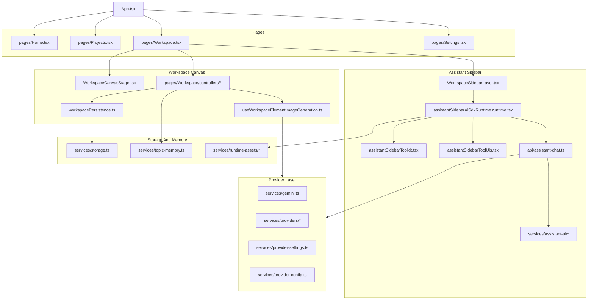

# XC Studio Project Module Map

Last updated: 2026-07-08

This map records the current module boundaries. Do not use older references to
`useWorkspaceSend`, `useWorkspaceSmartGenerate`, or `useAgentOrchestrator` as
sidebar chat entry points; those paths have been removed from the workspace
assistant route.

## Current Topology

```mermaid
flowchart TD
    App[App.tsx]

    subgraph Pages[Pages]
        Home[pages/Home.tsx]
        Projects[pages/Projects.tsx]
        Workspace[pages/Workspace.tsx]
        Settings[pages/Settings.tsx]
    end

    subgraph AssistantUI[Assistant Sidebar]
        SidebarLayer[WorkspaceSidebarLayer.tsx]
        Runtime[assistantSidebarAiSdkRuntime.runtime.tsx]
        ClientToolkit[assistantSidebarToolkit.tsx]
        ToolUIs[assistantSidebarToolUis.tsx]
        ChatApi[api/assistant-chat.ts]
        ServerToolkit[services/assistant-ui/*]
    end

    subgraph WorkspaceCanvas[Workspace Canvas]
        CanvasStage[WorkspaceCanvasStage.tsx]
        WorkspaceControllers[pages/Workspace/controllers/*]
        ImageGeneration[useWorkspaceElementImageGeneration.ts]
        Persistence[workspacePersistence.ts]
    end

    subgraph Providers[Provider Layer]
        Gemini[services/gemini.ts]
        ProviderAdapters[services/providers/*]
        ProviderSettings[services/provider-settings.ts]
        ProviderConfig[services/provider-config.ts]
    end

    subgraph Storage[Storage And Memory]
        IndexedDB[services/storage.ts]
        TopicMemory[services/topic-memory.ts]
        RuntimeAssets[services/runtime-assets/*]
    end

    App --> Home
    App --> Projects
    App --> Workspace
    App --> Settings

    Workspace --> SidebarLayer
    SidebarLayer --> Runtime
    Runtime --> ClientToolkit
    Runtime --> ToolUIs
    Runtime --> ChatApi
    ChatApi --> ServerToolkit

    Workspace --> CanvasStage
    Workspace --> WorkspaceControllers
    WorkspaceControllers --> ImageGeneration
    WorkspaceControllers --> Persistence

    ChatApi --> Providers
    ImageGeneration --> Providers
    Persistence --> IndexedDB
    WorkspaceControllers --> TopicMemory
    Runtime --> RuntimeAssets
```

## Sidebar Authority

- Frontend runtime: `useChatRuntime` + `AssistantChatTransport`.
- Thread list and history: assistant-ui remote thread runtime plus
  `ThreadHistoryAdapter.withFormat` over AI SDK `UIMessage` parts.
- Tool UI: assistant-ui `defineToolkit`, `Tools`, `providerTool`,
  `externalTool`, `stubTool`, and `useAuiToolOverrides`.
- Server tools: AI SDK `tool` / provider tools through
  `AISDKToolkit(...).tools({ frontend })`.
- Streaming: AI SDK `streamText` and UI message/data parts.

## Workspace Canvas Authority

- Canvas image generation and editing still live in
  `pages/Workspace/controllers/useWorkspaceElementImageGeneration.ts` and
  related canvas controllers.
- Provider settings and project-specific canvas sync are XC Studio glue and may
  remain outside assistant-ui as long as the sidebar calls them through official
  tools or explicit canvas APIs.

## Removed Entry Points

These paths must not be recreated as sidebar chat routes:

- `pages/Workspace/controllers/useWorkspaceSend.ts`
- `pages/Workspace/controllers/useWorkspaceSmartGenerate.ts`
- `hooks/useAgentOrchestrator.ts`
- legacy `AssistantSidebar*.tsx`, `AgentMessage`, `MessageList`, and
  `InputArea*` components.

If a capability from an old path is still valuable, reintroduce it as an
assistant-ui toolkit entry, AI SDK server tool, provider-native tool, MCP tool,
or explicit canvas action. Do not adapt legacy `ChatMessage.agentData` progress
or old agent routing state into the assistant-ui sidebar.

## Recommended Reading

1. `docs/architecture/WORKSPACE_REFACTOR_MAP.md`
2. `pages/Workspace/components/assistantSidebarAiSdkRuntime.runtime.tsx`
3. `pages/Workspace/components/assistantSidebarToolkit.tsx`
4. `api/assistant-chat.ts`
5. `services/assistant-ui/assistant-sidebar-server-toolkit.ts`
6. `pages/Workspace/controllers/useWorkspaceElementImageGeneration.ts`
7. `services/provider-settings.ts`
8. `services/storage.ts`
