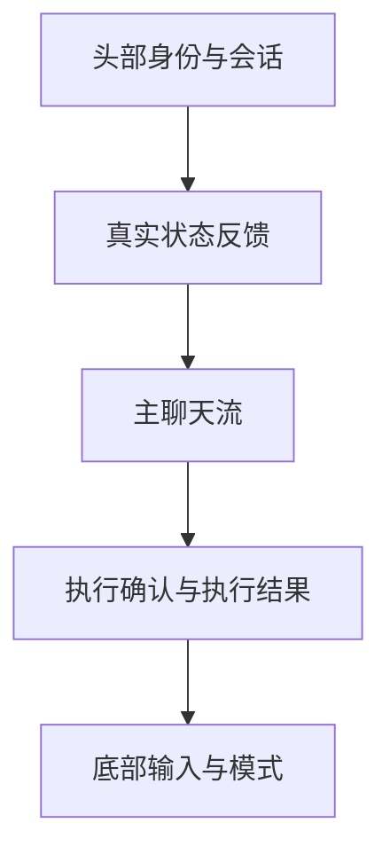

# 侧边栏主脑重构详细方案

日期：2026-05-12
状态：已完成并通过本轮验收
阶段：产品 / UI / 前端联合验收完成
关联文件：[`AssistantSidebar.tsx`](../../pages/Workspace/components/AssistantSidebar.tsx)、[`useAssistantSidebarBrowserAgentUi.ts`](../../pages/Workspace/controllers/useAssistantSidebarBrowserAgentUi.ts)、[`InputAreaBottomToolbar.tsx`](../../pages/Workspace/components/InputAreaBottomToolbar.tsx)、[`AgentTaskMetadata`](../../types/agent.types.ts:199)

---

## 0. 本稿对上一版方案的修正

这版方案在上一轮计划基础上，做了 6 个关键纠偏：

1. **纠正产品主次**
   - 上一版虽然提出了聊天优先，但还默认保留了较强的执行链路显性存在感。
   - 本版明确改为：**侧边栏前台永远只有主脑，执行代理不是前台人格，也不是并列模式。**

2. **收紧自动分流，不再把执行判断放在输入最前面**
   - 当前错误入口在 [`shouldRouteSidebarMessageToBrowserAgent()`](../../pages/Workspace/components/AssistantSidebar.tsx:76) 与 [`shouldUseBrowserAgentChat`](../../pages/Workspace/components/AssistantSidebar.tsx:1062)。
   - 本版要求把“是否进入执行链路”改成**主脑理解后的后置决策**，而不是正则前置拦截。

3. **把“假思考 / 假状态 / 假能力”作为独立治理项**
   - 不是单纯改文案，而是要求建立“显示字段真实来源表”。
   - 凡是 UI 上显示的状态、模型、计划、思考、文件、数量，都必须可追到真实数据源。

4. **把“记住知识”从模糊概念改成结构化记忆分层**
   - 区分长期品牌层、当前会话层、当前执行层。
   - 执行链路只拿压缩摘要，不直接拿整段聊天。

5. **增加“执行前确认”与“执行后解释”的双层保护**
   - 用户需要知道：
     - 系统理解了什么
     - 为什么准备执行
     - 刚才执行了什么
     - 为什么失败

6. **把“开始干活”拆成可实施阶段，不直接一把梭**
   - 先纠偏路由层级
   - 再补上下文桥接
   - 再重构 UI 与文案
   - 最后清理假能力与无效显示

---

## 1. 页面目标

把当前侧边栏重构成一个真正可连续对话、可吸收品牌知识、可管理参考素材、可解释自身行为、并在必要时再调用执行链路的 [`主脑侧边栏`](../../pages/Workspace/components/AssistantSidebar.tsx)。

核心目标不是“尽快执行”，而是：

1. 先理解
2. 先记住
3. 先澄清
4. 再决定是否执行
5. 执行后仍由主脑解释结果

一句话定义：

> 侧边栏首先必须是一个可信、会理解、会记忆、会解释的主脑，其次才是一个会调工具的工作入口。

---

## 2. 用户主任务

### 2.1 主任务

用户在侧边栏里的主任务应拆成 5 类：

1. **补充知识**
   - 输入品牌资料、产品背景、风格限制、视觉偏好、禁区、长期规则。

2. **解释素材**
   - 告诉主脑每张参考图分别代表什么，不是什么。

3. **澄清目标**
   - 和主脑讨论本轮到底要做什么、还缺什么、该先出方案还是先执行。

4. **确认执行**
   - 在上下文足够后，确认让主脑去检查节点、改参数、生成图片、读 trace、继续任务。

5. **回看结果**
   - 理解刚才做了什么、为什么失败、下一步建议是什么。

### 2.2 非主任务

以下行为不应被当成默认主任务：

- 直接暴露执行代理内部状态
- 直接暴露 planner 术语
- 直接暴露 host action / tool id 级别的内部结构
- 把 progress log 假装成思考过程

---

## 3. 现状勘察与问题归因

## 3.1 路由层级反了

当前侧边栏存在一个根本性问题：执行接管发生在主脑理解之前。

关键位置：
- [`shouldRouteSidebarMessageToBrowserAgent()`](../../pages/Workspace/components/AssistantSidebar.tsx:76)
- [`shouldUseBrowserAgentChat`](../../pages/Workspace/components/AssistantSidebar.tsx:1062)

问题表现：
- 用户刚在补品牌知识，系统就可能因为句子里带“生成 / 执行 / 开始”而切入执行规划。
- 主脑还没来得及理解、复述、追问，就被执行链路抢前台。

### 直接结论

这是目前最优先的结构性错误，必须作为 P0 修复。

---

## 3.2 主脑链路和执行链路能力不对称

普通主脑链路已经具备：
- [`brandInfo`](../../hooks/useAgentOrchestrator.ts:213)
- [`conversationHistory`](../../hooks/useAgentOrchestrator.ts:214)
- [`buildTopicPinnedContext()`](../../services/agents/orchestrator-preparation.ts:197)
- 以及在 [`enhanced-orchestrator.ts`](../../services/agents/enhanced-orchestrator.ts:227) 中显式注入品牌信息

但执行链路当前只拿：
- 当前目标
- 当前附件转成的参考图
- 当前节点
- 少量 metadata

关键位置：
- [`buildReferenceImagesFromAttachments()`](../../pages/Workspace/controllers/useAssistantSidebarBrowserAgentUi.ts:392)
- [`browser.plan_goal_session`](../../pages/Workspace/controllers/useAssistantSidebarBrowserAgentUi.ts:948)
- [`planBrowserAgentGoalSession()`](../../services/browser-agent/goal-planner.ts:962)

### 直接结论

执行链路本身不是聊天智能体，它现在吃不到足够上下文，所以体感自然更像“流程机”。

---

## 3.3 假状态、假思考、假反馈过多

### 问题 1：状态条是假的
- [`AssistantSidebarStatusBanner`](../../pages/Workspace/components/AssistantSidebarStatusBanner.tsx:4)
- `JK` 徽标和跳点动画没有真实信息价值。

### 问题 2：思考动画是假的
- [`MessageList`](../../pages/Workspace/components/MessageList.tsx:139)
- `思考中...` 只是空泛占位，没有说明系统到底在做什么。

### 问题 3：progressLog 被伪装成思考过程
- [`TaskProgress`](../../components/agents/TaskProgress.tsx:123)
- 文案写成“展开思考过程”，但实际展示的是执行记录。

### 问题 4：分析说明像免责声明
- [`AgentMessage`](../../pages/Workspace/components/AgentMessage.tsx:236)
- 当前“本次展示的是任务分析，不是完整思考过程”这类文案像补丁说明，不像产品话术。

### 直接结论

必须建立一个原则：

> 任何展示给用户的状态，必须有真实数据来源；任何没有真实来源的动画和文案，一律删除。

---

## 3.4 有效能力与无效能力混杂

### 示例 1：无效按钮
- [`Share2`](../../pages/Workspace/components/AssistantSidebarHeader.tsx:80) 当前没有明确闭环，应下沉或下线。

### 示例 2：伪模式开关心智
- 当前 UI 还残留“执行代理 / 普通聊天”的并列心智影子。
- 这与主脑前台唯一人格冲突。

### 示例 3：显示了但用户不关心的内部字段
- [`AssistantSidebarPlanCard`](../../pages/Workspace/components/AssistantSidebarPlanCard.tsx:116) 到 [`AssistantSidebarPlanCard.tsx`](../../pages/Workspace/components/AssistantSidebarPlanCard.tsx:243) 当前信息量过重。
- 里面混入了任务类型、模型、质量、步骤种类等大量工程或半工程字段，抢占用户注意力。

---

## 3.5 模式与入口语义有混淆

当前 [`InputAreaBottomToolbar`](../../pages/Workspace/components/InputAreaBottomToolbar.tsx:854) 里的“主脑 / 图像生成器 / 视频生成器”是内容产出模式，这个方向是合理的。

但问题在于：
- 它没有和“主脑前台唯一人格”充分对齐
- 用户容易误解成：不同模式就是不同智能体
- 更容易加剧“侧边栏不是一个会聊天的主脑，而是工作流切换器”的感受

### 纠偏结论

保留“主脑 / 图像 / 视频”作为**产出模式**可以，但不能再叠加“普通聊天 / 执行代理”之类第二层模式心智。

---

## 4. 信息架构

## 4.1 一级结构

建议把侧边栏固定为 5 层结构：

## 4.2 各层定义

### A. 头部身份与会话
主任务：
- 告诉用户“现在是在和谁说话”
- 管理当前会话
- 提供历史与文件二级入口

只保留：
- 主脑标题
- 当前会话标题
- 新对话
- 历史
- 文件
- 全屏
- 收起

下沉或下线：
- [`Share2`](../../pages/Workspace/components/AssistantSidebarHeader.tsx:80)

### B. 真实状态反馈
主任务：
- 用一句人话告诉用户系统现在在做什么

只允许显示：
- 已记住品牌约束
- 正在读取当前节点
- 正在确认参考图角色
- 等待你确认
- 正在执行
- 已完成
- 执行失败

禁止显示：
- 无来源动画点
- 固定 logo 状态球
- 空泛“思考中”

### C. 主聊天流
主任务：
- 让主脑成为绝对主线

包含：
- 用户消息
- 主脑理解回复
- 主脑吸收知识摘要
- 主脑澄清问题
- 主脑执行解释
- 主脑失败解释

### D. 执行确认与执行结果
主任务：
- 只在真要执行时才出现
- 不是常驻面板，不应抢聊天主线

包含：
- 执行前确认卡
- 执行中真实记录卡
- 执行后结果解释卡
- 执行失败卡

### E. 底部输入与模式
主任务：
- 继续承载输入
- 明确当前产出模式
- 保证聊天先行、工具后置

---

## 5. 哪些内容必须进入二级入口

以下内容不应默认暴露在主界面：

1. 全量执行步骤明细
2. 原始 trace 全文
3. research 引用全文
4. 文件全量明细列表
5. 模型覆盖风险提示长文
6. 内部 planner / session / action 术语

二级入口建议：
- 查看执行记录
- 查看详细诊断
- 查看参考图说明
- 查看本轮文件

---

## 6. 功能清单与优先级

## 6.1 P0 必做

1. 把侧边栏恢复成 chat-first
2. 删除执行链路前置接管
3. 补主脑到执行链路的上下文桥接
4. 删除假思考、假状态、假动画
5. 重写词不达意的核心文案
6. 建立显示字段真实来源表

## 6.2 P1 高优先

1. 执行前确认卡重写
2. 失败原因与修复建议重写
3. 文件列表语义化
4. 参考图角色说明回显
5. 吸收知识后的显性反馈

## 6.3 P2 中优先

1. 长期记忆 / 会话摘要可视化
2. 建议下一步能力
3. 会话摘要导出
4. 主脑工作记录视图

---

## 7. 文案重构稿

## 7.1 头部文案

### 当前问题
- [`沉浸式聊天工作区`](../../pages/Workspace/components/AssistantSidebarHeader.tsx:50) 偏空、偏装饰。

### 改法
- 标题：`主脑`
- 副标题候选：
  - `先聊清楚，再开始做`
  - `我会先理解你的目标和约束`
  - `当前会话会记住这轮品牌和执行上下文`

建议默认：
- 标题：`主脑`
- 副标题：`先聊清楚，再开始做`

---

## 7.2 状态反馈文案

### 删除
- `思考中...`
- 无意义点点动画
- `执行代理`
- `待确认计划`

### 改成

#### 理解中
- `我先整理一下你刚刚补充的信息`
- `我正在确认这轮目标、品牌约束和参考素材`

#### 已吸收
- `我已经记住这轮品牌限制`
- `我已经记录这几张参考图的分工`

#### 等待确认
- `我准备这样做，确认后再开始`
- `开始前我先和你确认一下执行方式`

#### 执行中
- `我正在读取当前节点状态`
- `我正在确认这轮参数和参考图`
- `我正在等待这轮结果返回`

#### 失败
- `这一步没能顺利开始`
- `当前节点状态还不够完整，我先不继续硬跑`
- `这轮参考图没有成功带进执行链路`

---

## 7.3 主脑理解回复文案

### 吸收知识时
- `我先记住这些品牌要求，不直接执行。`
- `这轮我会优先保留这些固定约束：主体清晰、中性色、克制留白、不要高饱和。`

### 吸收参考图时
- `我会把第 1 张当主体参考，第 2 张当构图参考，第 3 张当品牌氛围参考。`
- `如果后面开始生图，我会优先继承这些参考图的分工，而不是把它们混成一张图的平均值。`

### 需要追问时
- `我已经理解了方向，但现在还缺一个关键点：这轮要做首图、详情页，还是风格定调图？`

### 准备执行时
- `我理解你现在是要基于刚才的规则继续推进当前节点，所以我会先检查节点和参考图，再决定是否直接生成。`

---

## 7.4 执行确认卡文案

### 当前问题
- 当前 [`AssistantSidebarPlanCard`](../../pages/Workspace/components/AssistantSidebarPlanCard.tsx:96) 更像后台执行面板。

### 改造后文案结构
1. 标题：`我准备这样做`
2. 一句话说明：`开始前我先和你确认一下，避免跑偏。`
3. 三块内容：
   - `我理解的目标`
   - `我会先检查什么`
   - `这一步可能的风险`
4. 按钮：
   - `先别执行`
   - `按这个开始`

### 禁止出现的用户前台字段
- `taskType`
- `deliverable`
- `plannerModel`
- `executionStrategy`
- `执行动作 / 信息读取` 这类内部步骤分类

这些字段可以保留给调试视图或二级详情，不进入默认确认卡。

---

## 7.5 执行记录文案

把 [`TaskProgress`](../../components/agents/TaskProgress.tsx:40) 的“展开思考过程”改成：
- `查看执行记录`
- `查看本轮处理记录`

把日志项定义成：
- 已读取当前节点参数
- 已识别参考图数量
- 已开始生成
- 正在等待结果
- 已拿到结果
- 这一步失败，原因如下

禁止再把执行日志叫思考过程。

---

## 8. UI 重构方案

## 8.1 页面区块划分

### 区块一：头部身份区
文件：[`AssistantSidebarHeader.tsx`](../../pages/Workspace/components/AssistantSidebarHeader.tsx)

目标：
- 让用户明确“在和主脑说话”
- 减少顶部工具噪声

调整：
- 去掉空 Share
- 强化会话标题
- 副标题换成人话
- 历史与文件入口做轻量化

### 区块二：真实状态条
文件：[`AssistantSidebarStatusBanner.tsx`](../../pages/Workspace/components/AssistantSidebarStatusBanner.tsx)

目标：
- 一行内说清系统在干嘛

调整：
- 去掉 logo 球、去掉跳点
- 改成单行文本 + 小状态 icon
- 只在真实状态存在时显示

### 区块三：聊天主流
文件：[`MessageList.tsx`](../../pages/Workspace/components/MessageList.tsx)

目标：
- 聊天是主线
- 执行只是聊天中的一种卡片

调整：
- 删除“思考中”假占位
- 把吸收知识、确认执行、失败解释做成标准消息类型

### 区块四：执行卡片
文件：[`AssistantSidebarPlanCard.tsx`](../../pages/Workspace/components/AssistantSidebarPlanCard.tsx)

目标：
- 从后台面板改成轻量确认卡

调整：
- 默认只显示用户关心的三件事
- 复杂字段进入折叠详情

### 区块五：输入区与模式区
文件：[`InputAreaBottomToolbar.tsx`](../../pages/Workspace/components/InputAreaBottomToolbar.tsx:854)

目标：
- 保留主脑 / 图像 / 视频作为产出模式
- 不再露出执行代理概念

调整：
- 让主脑入口永远是默认人格入口
- 工具参数只在图像 / 视频模式显著显示
- 主脑模式下减少工具味

### 区块六：文件列表
文件：[`AssistantSidebarFilesPopover.tsx`](../../pages/Workspace/components/AssistantSidebarFilesPopover.tsx)

目标：
- 从“文件仓库”改成“本轮产出”二级入口

调整：
- 标题改成 `本轮产出`
- 数量文案改成真实图片数 / 视频数
- 默认按最近结果排序
- 支持从主脑语义回到对应消息

---

## 8.2 低保真线框说明

### 默认聊天态
- Header
- 状态条可选显示
- 用户消息
- 主脑回复
- 输入区

### 吸收知识态
- 用户输入品牌知识
- 主脑回一条 `我已经记住这些内容`
- 不执行

### 执行前
- 用户明确要求开始
- 主脑先复述目标
- 插入确认卡
- 用户确认后继续

### 执行中
- 状态条显示真实进度
- 聊天流插入执行记录卡

### 执行后
- 主脑解释结果
- 如果失败，给出失败原因和建议动作

---

## 8.3 视觉规范

### Spacing
- 4 / 8 / 12 / 16 / 24 / 32
- 卡片内边距统一 16
- 区块间距统一 16 或 24

### Typography
- 标题：16-18 / semibold
- 正文：13-14 / regular
- 辅助：11-12 / regular

### Radius
- 输入与卡片：12
- pill：9999 但减少数量

### Colors
- 中性色为主
- 单一低饱和蓝作主色
- 成功 / 警告 / 错误各自单色

### 禁止项
- 拟物小球假反馈
- 高对比伪状态动画
- 大面积重阴影
- 多套卡片风格混用

---

## 9. 前端实施架构

## 9.1 路由治理

### 当前错误
前置正则直接决定执行接管：
- [`shouldRouteSidebarMessageToBrowserAgent()`](../../pages/Workspace/components/AssistantSidebar.tsx:76)

### 目标架构
改成两阶段：

1. **理解阶段**
   - 所有输入先给主脑理解
2. **决策阶段**
   - 主脑输出：
     - 只回答
     - 继续追问
     - 吸收知识
     - 准备执行
     - 继续执行

### 结果
执行代理不再是“抢入口”，而是“主脑调用的执行能力”。

---

## 9.2 上下文桥接

## 9.2.1 数据模型扩展
扩展 [`AgentTaskMetadata`](../../types/agent.types.ts:199)：

新增建议字段：
- `brandContextSummary?: string`
- `topicPinnedContext?: string`
- `conversationConstraintSummary?: string`
- `referenceIntentSummary?: string`
- `memoryCaptureSummary?: string`
- `knowledgeCaptureItems?: string[]`

## 9.2.2 结构化摘要分层

### 长期品牌层
- 品牌定位
- 美学偏好
- 禁区
- 长期风格原则

### 当前会话层
- 这轮目标
- 本轮新增约束
- 本轮必须保留的元素
- 当前讨论出的替换关系

### 当前执行层
- 当前节点
- 当前参考图分工
- 本轮直接生成参数

## 9.2.3 执行前注入
把压缩摘要注入：
- [`SidebarBrowserAgentTaskMetadata`](../../pages/Workspace/controllers/assistantSidebarBrowserAgentMetadata.ts)
- [`browser.plan_goal_session`](../../pages/Workspace/controllers/useAssistantSidebarBrowserAgentUi.ts:948)
- [`browser.start_session`](../../pages/Workspace/controllers/useAssistantSidebarBrowserAgentUi.ts:1141)
- [`planBrowserAgentGoalSession()`](../../services/browser-agent/goal-planner.ts:962)

## 9.2.4 continue session 继承
继续执行必须继承：
- goal
- inputReferenceImages
- brandContextSummary
- conversationConstraintSummary
- referenceIntentSummary

否则第二轮仍会失忆。

---

## 9.3 真值显示治理

建立一张“字段真实来源表”，每个 UI 字段都要标注来源：

| UI 字段 | 是否保留 | 真实来源 | 备注 |
|---|---|---|---|
| 当前状态 | 保留 | session metadata / execution state | 不允许伪动画占位 |
| 当前模型 | 保留 | 当前节点真实 control 或执行回执 | 不能只读计划草稿 |
| 参考图数量 | 保留 | referenceImages 真值 | 需与执行链路一致 |
| 思考过程 | 删除 | 无真实同义数据 | 改为执行记录 |
| Share | 下线 | 当前无闭环 | 进入二级需求 |
| 待确认计划 | 重命名 | prepared plan | 改成人话 |

---

## 10. 组件重构清单

## 10.1 必重构组件
- [`AssistantSidebar.tsx`](../../pages/Workspace/components/AssistantSidebar.tsx)
- [`useAssistantSidebarBrowserAgentUi.ts`](../../pages/Workspace/controllers/useAssistantSidebarBrowserAgentUi.ts)
- [`assistantSidebarBrowserAgentMetadata.ts`](../../pages/Workspace/controllers/assistantSidebarBrowserAgentMetadata.ts)
- [`AssistantSidebarStatusBanner.tsx`](../../pages/Workspace/components/AssistantSidebarStatusBanner.tsx)
- [`AssistantSidebarPlanCard.tsx`](../../pages/Workspace/components/AssistantSidebarPlanCard.tsx)
- [`MessageList.tsx`](../../pages/Workspace/components/MessageList.tsx)
- [`TaskProgress.tsx`](../../components/agents/TaskProgress.tsx)
- [`InputAreaBottomToolbar.tsx`](../../pages/Workspace/components/InputAreaBottomToolbar.tsx)
- [`AssistantSidebarFilesPopover.tsx`](../../pages/Workspace/components/AssistantSidebarFilesPopover.tsx)
- [`AgentMessage.tsx`](../../pages/Workspace/components/AgentMessage.tsx)

## 10.2 新增建议组件
- `AssistantIdentityBar`
- `AssistantMemoryCaptureCard`
- `AssistantExecutionConfirmCard`
- `AssistantExecutionRecordCard`
- `AssistantExecutionFailureCard`
- `AssistantKnowledgeSummaryCard`

---

## 11. 风险点补充

## 11.1 过度把所有信息都喂给执行链路
风险：
- 上下文过长
- 冲突约束叠加
- 执行成本和失败率上升

对策：
- 主脑先做结构化压缩摘要
- 执行链路只吃摘要，不吃整段聊天

## 11.2 UI 只改皮，不改真值
风险：
- 看起来更漂亮，但还是假的

对策：
- 每个状态字段必须先过真值校验表

## 11.3 过早保留过多调试信息
风险：
- 继续像后台工具

对策：
- 默认界面只给用户关心的信息
- 其余全部下沉到二级详情

## 11.4 聊天与执行之间来回跳引发割裂
风险：
- 用户仍感觉换了一个智能体

对策：
- 所有执行消息由主脑口吻输出
- 执行代理不作为独立前台人格出现

---

## 12. 实施阶段计划

## Phase 1：纠正入口层级
目标：让主脑重新拿回前台

执行项：
1. 去掉执行链路前置接管
2. 默认所有输入先走主脑理解
3. 重写侧边栏消息决策策略
4. 移除“执行代理 / 普通聊天”显性模式心智

通过标准：
- 用户补品牌知识时不会自动起执行计划
- 用户问问题时不会直接进入执行流程
- 主脑能先复述，再建议下一步

## Phase 2：记忆与上下文桥接
目标：执行链路继承主脑理解

执行项：
1. 扩展 metadata 字段
2. 生成品牌摘要 / 会话约束摘要 / 参考图语义摘要
3. 执行前写入 planner
4. continue session 时继续继承

通过标准：
- 主脑吸收过的知识能影响后续生图
- 第二轮继续执行不丢上下文

## Phase 3：文案重写与假能力清理
目标：把词不达意、假反馈、伪思考清掉

执行项：
1. 删除假状态动画
2. 删除假思考文案
3. 删除无闭环能力入口
4. 重写执行前 / 执行中 / 失败 / 成功文案

通过标准：
- 任意提示都能说清系统现在在干嘛
- 不再出现“显示了但其实没用”的信息

## Phase 4：UI 重构
目标：让聊天主线清晰、状态克制、执行卡轻量

执行项：
1. 头部减负
2. 状态条重做
3. 计划卡瘦身
4. 文件列表语义化
5. 输入区收敛

通过标准：
- 页面一眼能看懂主次关系
- 不再像后台调试面板

## Phase 5：一致性与验收
目标：确保不是东一块西一块地修

执行结果：
1. 已统一状态枚举与显示文案入口，执行状态统一收口到 [`getBrowserSessionStatusLabel()`](../../pages/Workspace/components/AssistantSidebar.tsx:97)
2. 已统一侧边栏消息展示契约，在 [`ChatMessage`](../../types/common.ts:196) 的 [`agentData.presentation`](../../types/common.ts:253) 下收口展示语义
3. 已统一执行确认 / 执行记录 / 判断说明的展示入口，通过 [`deriveAgentMessagePresentation()`](../../pages/Workspace/components/AgentMessage.helpers.ts:271) 与 [`AgentMessage.tsx`](../../pages/Workspace/components/AgentMessage.tsx:221) 消费
4. 已统一主脑 / 图片 / 视频入口语义，在 [`InputAreaBottomToolbar.tsx`](../../pages/Workspace/components/InputAreaBottomToolbar.tsx:526) 收敛为“主脑对话 / 图片任务 / 视频任务”
5. 已完成本轮产品 / UI / 前端联合验收回写，并确认主路径上不再残留“执行代理 / 图像生成器 / 视频生成器 / 思考中...”等错误心智文案

验收结果：
- 同类状态只出现一套说法
- 同类卡片只出现一套结构
- 任何显示内容都能追到真实来源
- 侧边栏主路径已恢复 chat-first，执行链路成为主脑后置能力，而非前台并列人格

---

## 13. 验收标准

以下任一出现即视为未通过：

1. 用户补充知识时仍被自动切入执行链路
2. 仍然存在“思考中...”这类无信息占位
3. 仍然存在假状态条或无意义动画
4. 执行链路不能继承品牌摘要与会话约束
5. 前台仍暴露“执行代理”独立人格心智
6. 默认界面仍堆叠过量工程字段
7. 用户无法知道系统记住了什么
8. 文案仍然术语化、像内部日志、像补丁说明

---

## 14. 最终结论

这次侧边栏不是做一次局部修补，而是一次完整的“主脑产品化重构”。

最关键的不是先改皮肤，而是先改 3 个根：

1. **入口层级**：聊天优先，执行后置  
2. **上下文桥接**：主脑理解结果必须进入执行链路  
3. **真假一致**：所有显示状态都必须有真实来源  

只要这 3 个根不改，后面再怎么补按钮、补卡片、补动画，用户体感都会继续像“一个会抢话筒的自动流程机”。

如果这 3 个根改对了，侧边栏才会真正变成：

> 一个先正常聊天、会记住上下文、会澄清目标、会解释动作、最后才去调工具做事的主脑工作台。
